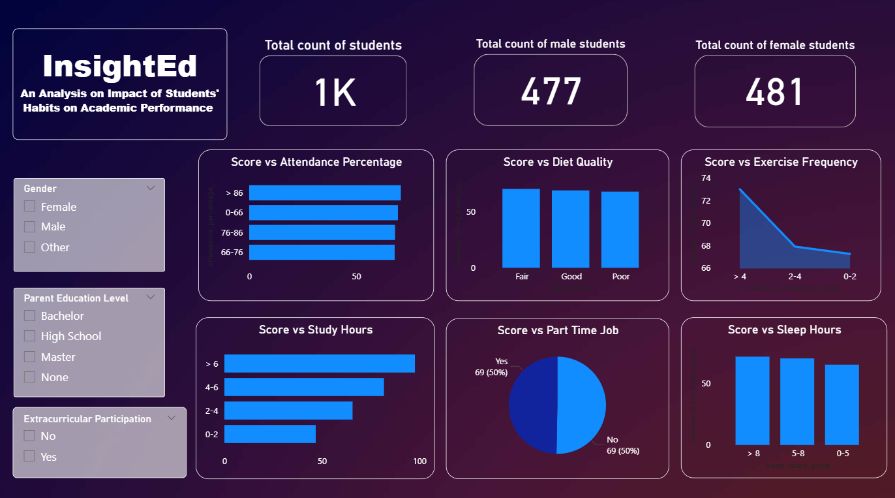

# 📊 InsightEd: Student Performance Analytics Dashboard

**InsightEd** is a complete end-to-end data analytics project that analyzes how students’ daily habits impact their academic performance. Using real-world data from **Kaggle**, the project applies structured **MySQL data cleaning**, thoughtful feature engineering, and interactive data visualization with **Microsoft Power BI** to derive actionable academic insights.

---

## 📂 Dataset

📌 **Source:** [Kaggle – Student Habits vs Academic Performance](https://www.kaggle.com/datasets/jayaantanaath/student-habits-vs-academic-performance)

- Format: `.csv`
- Records: 1,000 students
- Fields: Gender, Attendance, Study Hours, Sleep Hours, Exercise Frequency, Diet Quality, Parent Education Level, Extracurriculars, Part-Time Job, Exam Score

---

## 🧰 Tech Stack & Tools Used

| Component           | Technology/Tool             |
|--------------------|-----------------------------|
| Data Source         | Kaggle (CSV Format)         |
| Data Cleaning       | MySQL (SQL: Filtering, Binning, Grouping) |
| Data Transformation | MySQL + Excel               |
| Data Visualization  | Microsoft Power BI          |
| Dashboard Features  | DAX Measures, Filters, Slicers |
| Deployment          | GitHub, Power BI Service    |

---

## 🧱 Project Workflow

### 1. 📥 Data Ingestion
- Loaded `.csv` dataset from Kaggle into MySQL
- Verified integrity and schema

### 2. 🧹 Data Cleaning & Transformation (MySQL)
- Removed invalid/null entries
- Binned continuous features into categories:
  - `study_hours_group`: 0–2, 2–4, 4–6, >6
  - `sleep_hours_group`: 0–5, 5–8, >8
  - `exercise_frequency_group`: 0–2, 2–4, >4
  - `attendance_group`: 0–66, 66–76, 76–86, >86
- Exported clean dataset to `dataset_transformation.csv` for Power BI

### 3. 📊 Power BI Dashboard Development
- Built charts using:
  - **Bar Charts**
  - **Pie Chart**
  - **Card Visuals**
- Used **DAX** to calculate:
  - Average score by category
  - Gender-based trends
  - Dynamic filters using slicers

---

## 🎯 Key Dashboard Features

### 🧩 Slicers / Filters:
- Gender
- Parent Education Level
- Extracurricular Participation

### 📈 Visualized Relationships:
- Score vs Attendance %
- Score vs Diet Quality
- Score vs Study Hours
- Score vs Sleep Hours
- Score vs Exercise Frequency
- Score vs Part-Time Job

---

## 🔍 Key Insights from the Dashboard

✔️ **Positive Correlation Between Physical Activity and Academic Performance**  
Students who engage in regular exercise tend to achieve higher average exam scores, suggesting that physical activity may contribute to improved focus and cognitive function.

✔️ **Study Hours as a Strong Performance Driver**  
There is a clear relationship between study time and academic outcomes — students who dedicate more hours to studying consistently outperform those with lower study hours.

✔️ **Optimal Sleep Range Identified**  
Students who sleep between 5 to 8 hours per night demonstrate the highest academic performance, indicating this range may strike the right balance between rest and productivity.

---

## 📸 Dashboard Preview

